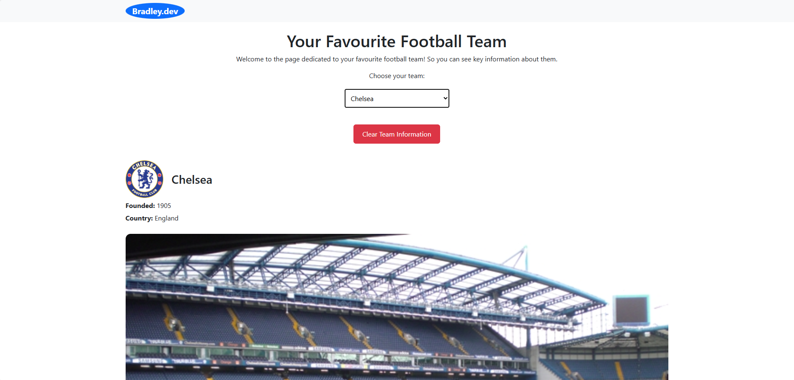
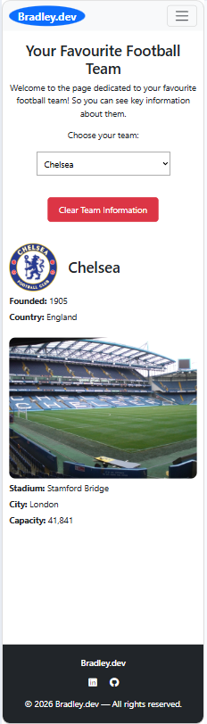

# ⚽ Favourite Football Team Viewer

A simple, responsive browser app that lets users select a Premier League team and view key club details instantly. The project uses HTML, CSS, and JavaScript, and fetches data from API‑Football via RapidAPI.

The app is fully front-end and deployed on GitHub Pages.

## 🚀 Live Demo

https://bradapple.github.io/milestone-2-your-favourite-football-team/

## 🎯 Project Purpose

This project demonstrates:

- Fetching data from a third-party API
- Handling asynchronous JavaScript with Promises
- DOM manipulation based on API responses
- Clean UI/UX with responsive design
- Event-driven programming
- Error handling and user feedback

It satisfies the coursework requirement for asynchronicity, callbacks/promises, and API integration.

## 🧩 Features

- Dropdown menu of Premier League teams (API‑Football team IDs)
- Fetches team and stadium data using the API‑Football `/teams` endpoint
- Displays:
  - Team name
  - Club crest
  - Founded year
  - Country
  - Stadium name
  - Stadium image
  - Stadium capacity
- Smooth animated card UI
- “Clear Team Information” button resets the interface
- Fully responsive layout
- Works entirely in the browser (no backend required)

## 👤 User Stories

- As a football fan, I want to select my favourite team from a dropdown so that I can instantly see information about the club.

- As a casual user, I want the interface to be clean and easy to understand so that I can quickly find what I want.
- As a student learning APIs, I want to see how asynchronous JavaScript works so that I can understand how to fetch and display external data.
- As a mobile user, I want the layout to be responsive so that the content is readable on any device.


## 🛠️ Technologies Used

- HTML5 — structure
- CSS3 — styling and layout
- JavaScript (ES6) — logic, async fetch, DOM manipulation
- API‑Football (via RapidAPI) — external data source
- GitHub Pages — hosting

## 🔗 API Usage

The project uses the API‑Football endpoint:

```http
GET https://api-football-v1.p.rapidapi.com/v3/teams?id={TEAM_ID}
```

Required headers:

```http
X-RapidAPI-Key: YOUR_KEY
X-RapidAPI-Host: api-football-v1.p.rapidapi.com
```

The response includes data under `data.response[0]` such as:

- `team.name`
- `team.logo`
- `team.founded`
- `team.country`
- `venue.name`
- `venue.image`
- `venue.capacity`
- `venue.city`

## ⚙️ Asynchronous JavaScript

This project demonstrates asynchronous behavior by:

- Using `fetch()` for API requests
- Using `.then()` promise chaining to process responses
- Using `.catch()` for error handling
- Updating the DOM after the promise resolves
- Using event listeners on `change` and `click`

Example:

```javascript
fetch(url, options)
  .then(res => res.json())
  .then(data => {
    const teamData = data.response[0];
    renderTeamCard(teamData);
  })
  .catch(err => console.error(err));
```

## 🧪 Testing

### Functional Testing

| Test | Expected Result | Status |
| --- | --- | --- |
| Selecting a team | Team card appears with correct data | ✔️ |
| Selecting a different team | Card updates with new team info | ✔️ |
| Pressing “Clear Team Information” | Dropdown resets and card disappears | ✔️ |
| API fetch success | Data loads without errors | ✔️ |
| API fetch failure (e.g. bad key) | Error logged in console | ✔️ |
| Viewing on mobile / small screens | Layout remains readable and centered | ✔️ |

### Manual Test Steps

1. Open the site in a browser.
2. Select a team from the dropdown.
3. Confirm:
   - Crest loads
   - Stadium image loads
   - Text fields populate correctly
4. Press the Clear Team Information button.
5. Confirm:
   - Dropdown resets to default
   - Team card content disappears
6. Repeat on mobile or in DevTools responsive mode.

### JSHint Metrics Summary
There are 5 functions in this file.

The function with the largest signature takes 1 argument, and the median is also 1.

The largest function contains 4 statements, while the median contains 2.

The most complex function has a cyclomatic complexity value of 2, while the median complexity is 1.


### W3 Validator


### CSS Validator


## 🐞 Known Issues

- API key must be exposed in the front-end (RapidAPI allows this, but it cannot be fully hidden).
- Free tier rate limits may cause temporary failures if overused.
- Stadium images and data quality depend on the external API.

## 📌 Future Improvements

- Add upcoming fixtures for the selected team.
- Add player squad list with photos.
- Add loading spinner while fetching data.
- Add user-friendly error messages instead of only console logs.
- Add theme colors based on team branding.
- Add animations for card transitions and hover effects.

## Deployment

### GitHub Pages Deployment
The site was deployed using GitHub Pages:

1. Go to the repository on GitHub.
2. Navigate to **Settings**.
3. Select **Pages** from the left menu.
4. Under *Source*, choose **main branch**.
5. Save and wait for the site to build.

**Live Site:**  
👉 *https://bradapple.github.io/milestone-2-your-favourite-football-team/index.html*

### How to Clone
1. Go to the repository.
2. Click **Code**.
3. Copy the HTTPS/SSH link.
4. Run:  
   `git clone https://github.com/Bradapple/milestone-2-your-favourite-football-team.git`

### How to Fork
1. Go to the repository.
2. Click **Fork** in the top-right corner.
3. A copy will be created in your GitHub account.

---

## Credits

### Content
- Copilot helped improve wording and structure of readme file.
- Referral to previous projects.
- https://www.api-football.com/ Providing the API for the basis of the website.
- Bootstrap for styling.

### Media
- Icons: **Font Awesome**

### Acknowledgements
- Code Institute for project guidance.
- Mentors, tutors, and peers for support.
- Bootstrap Documentation
- https://jshint.com/ - To check javascript code.

## 👨‍💻 Author

Bradley Smith

GitHub: https://github.com/bradapple
